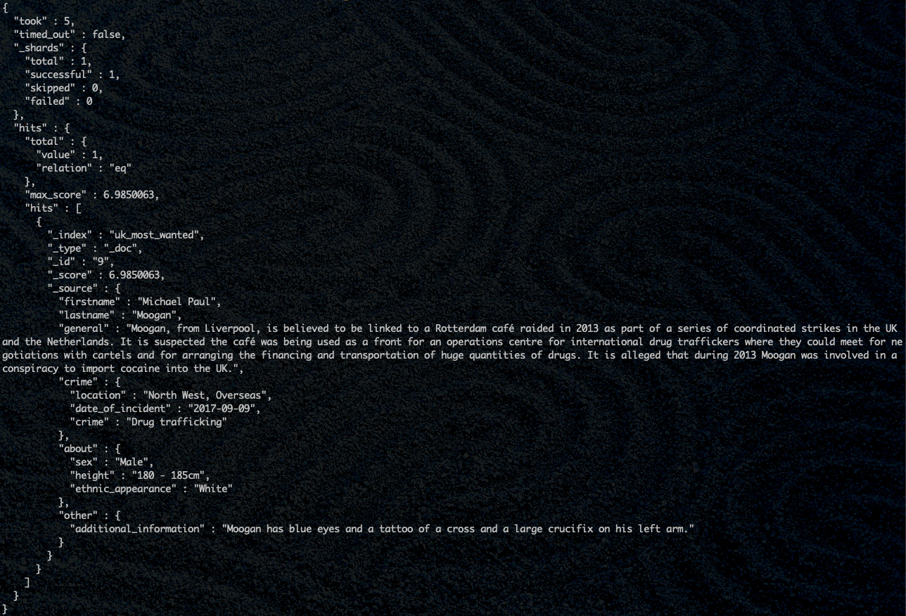

# criminal-scraper

> requests/bs4 web scraper to retrieve "Most Wanted" data

## Installation:

NOTE: tested for macOS, but installation on Linux or Windows should be similar.
Requirements: Python 3.6+, pip

- Clone repo with `git clone https://github.com/plt3/criminal-scraper`
- Navigate to project directory with `cd criminal-scraper`
 Recommended: create virtual environment: `python3 -m venv venv` and activate it: `source venv/bin/activate`
- Install dependencies with `pip install -r requirements.txt`

## Usage:

- In project home directory, run scraper with `python3 runScraper.py`
  - Note: the file itself is very short. The main scraper logic is in `scraper.py`
- If source code is not changed, this will write data to `UK_MWL_persons.json` in project home directory (although the file is already included in this repository anyways)
- Can override many defaults (output JSON file path, HTTP request delay) by passing extra arguments to either of the scraper's constructors. See Scraper class's source code for more information.
- Example of overriding output file path and HTTP request delay:

```python
from scraper import Scraper

scraperObj = Scraper.fromCsv(
    "bad_people_lists.csv",
    "UK_MWL",
    requestDelay=10,
    outputFile="/path/to/file.json",
)
scraperObj.scrapeAllPersons()
```

## Elasticsearch:

- Must first run an Elasticsearch Docker container locally
  - Can do so with `docker run -d -p 9200:9200 -e "discovery.type=single-node" elasticsearch:7.12.1`
- Then, run `python3 elastic/loadElasticsearch.py` once Docker container is running to load all data in UK_MWL_persons.json into Elasticsearch index
- Can run `elastic/fullnameQuery.sh` (may have to make file executable first) to query local Elasticsearch instance with criminal data loaded in an index called "uk_most_wanted"
- Check `elastic/MooganQuery.json` and `elastic/MooganQuery.png` (below) files to see the results of running fullnameQuery.sh


